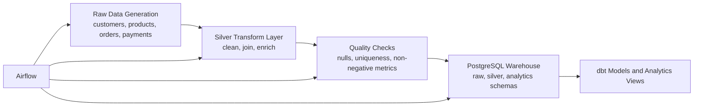

# Retail Analytics Lakehouse

An end-to-end data engineering portfolio project that simulates a modern analytics platform for an e-commerce business. The pipeline ingests operational data, transforms it through bronze and silver layers, validates data quality, and loads analytics-ready datasets into PostgreSQL for reporting and BI use cases.

## Project Summary

This project represents a real-world batch data engineering workflow designed to be strong enough for a resume, GitHub portfolio, and technical interviews.

It demonstrates how a data engineer can:

- ingest raw business data from multiple entities
- transform and enrich datasets into analytics-ready tables
- orchestrate data pipelines with Airflow
- load curated datasets into a warehouse
- apply quality checks before publishing data
- structure a project using reproducible local infrastructure

## What This Project Does

The pipeline simulates a retail company that needs daily analytics for orders, customers, products, and payments.

It performs the following steps:

1. Generates raw source data for customers, products, orders, and payments.
2. Builds a silver layer by standardizing and joining those datasets.
3. Runs data quality checks such as null validation, uniqueness checks, and non-negative business metric validation.
4. Loads raw and transformed tables into PostgreSQL schemas.
5. Exposes analytics-ready data for downstream dashboards and business reporting.

## Business Use Case

Imagine an e-commerce company that wants to answer questions like:

- How much revenue did we generate this month?
- Which product categories perform best?
- What is each customer's lifetime value?
- Which payment methods are most common?
- Are delivery times staying within expected ranges?

This project builds the data foundation needed to answer those questions reliably.

## Architecture



## Airflow Pipeline

The orchestration layer is built with Apache Airflow. The DAG executes the full pipeline in sequence:

- `generate_raw_data`
- `build_silver_layer`
- `run_quality_checks`
- `load_to_postgres`

### Airflow DAG Run

Add your Airflow success screenshot at `assets/airflow-dag-success.png` and it will render automatically below.


## Medallion Layers

### Bronze / Raw

- `customers.csv`
- `products.csv`
- `orders.csv`
- `payments.csv`

### Silver

- standardized customer data
- standardized product data
- joined order facts
- customer revenue summary

### Analytics

- warehouse views for revenue and category performance
- dbt marts for reporting and downstream BI

## Tech Stack

- Python
- Pandas
- SQLAlchemy
- PostgreSQL
- Apache Airflow
- dbt Core
- Docker Compose
- MinIO
- Spark scaffold for future extension

## Project Structure

```text
.
+-- dags/                       # Airflow DAG definitions
+-- data/
|   +-- raw/                    # Bronze layer placeholders
|   \-- processed/              # Silver layer placeholders
+-- dbt/                        # dbt models and tests
+-- docs/                       # Architecture and resume notes
+-- infra/                      # Dockerfiles and service configuration
+-- sql/init/                   # Database initialization scripts
+-- src/                        # Python pipeline implementation
\-- tests/                      # Unit tests
```

## Tools Used and Why

### Python

Used to implement the pipeline logic, generate source data, transform datasets, validate outputs, and load warehouse tables.

### Apache Airflow

Used to orchestrate the full data pipeline and provide scheduling, monitoring, retry behavior, and DAG visibility.

### PostgreSQL

Used as the analytics warehouse for storing curated tables and analytics views.

### dbt

Used to define warehouse transformations and tests in a way that is clean, modular, and analytics-friendly.

### Docker Compose

Used to run the platform locally in a reproducible way, including Airflow, PostgreSQL, and supporting services.

### MinIO

Included as local object storage to mirror a cloud-style architecture.

## How to Run Locally

### 1. Prepare environment variables

```bash
copy .env.example .env
```

### 2. Start the local data platform

```bash
docker compose up --build
```

### 3. Open Airflow

Go to [http://localhost:8080](http://localhost:8080)

Login:

- Username: `admin`
- Password: `admin`

### 4. Trigger the DAG

Run the DAG `ecommerce_analytics_pipeline` from the Airflow UI.

## Example Outputs

After a successful run, the project loads data into these PostgreSQL schemas:

- `raw`
- `silver`
- `analytics`

Examples of analytics outputs:

- monthly revenue trends
- customer lifetime value
- category performance
- average order value


## Future Improvements

- connect to a real API or transactional source instead of synthetic data
- store bronze and silver layers as Parquet in object storage
- add CI/CD for tests and linting
- build a BI dashboard in Power BI or Tableau
- deploy on AWS, Azure, or GCP services

